# Architecture & pipeline — diagrammes détaillés (Bloc 3)

> Diagrammes d'architecture (PNG) pour la soutenance. Commencer par la **vue simplifiée**, puis les schémas détaillés si le jury creuse le streaming, la data quality ou le déploiement.

---

## Vue simplifiée — à utiliser en soutenance

### A. Le pipeline en 7 étapes

Phrase à dire : *« Les capteurs envoient des mesures en continu. Redpanda reçoit le flux. Un consumer Python valide chaque événement, isole les erreurs, stocke la donnée dans Supabase, et le dashboard Vercel affiche l'état des zones et les alertes. »*

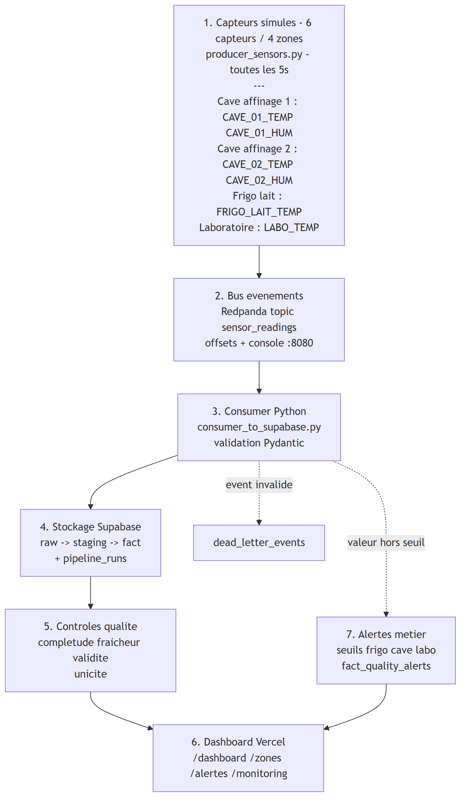

### B. Local vs Cloud — stratégie de démo

Phrase à dire : *« Le dashboard et la base sont en production sur Vercel et Supabase. Redpanda et les scripts Python tournent en local pendant la démo, car ce sont des composants de traitement continu, pas une app web. »*

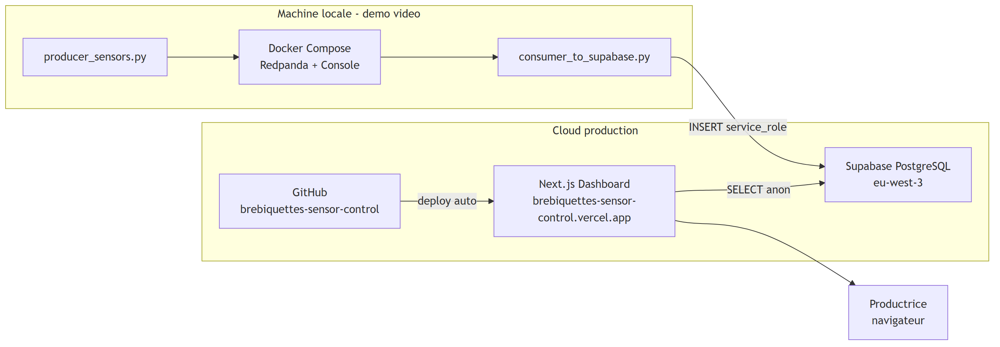

### C. Que se passe-t-il à chaque événement ?

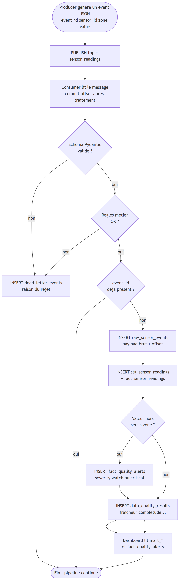

### D. Où sont les données et les signaux ?

| Question | Réponse simple |
|----------|----------------|
| Source terrain (simulée) ? | `producer_sensors.py` — 6 capteurs, 4 zones |
| Où transite le flux ? | Redpanda topic `sensor_readings` (local Docker) |
| Où est stockée la donnée brute ? | `raw_sensor_events` (JSON + offset Kafka) |
| Où est la donnée propre ? | `stg_sensor_readings`, `fact_sensor_readings` |
| Où sont les alertes métier ? | `fact_quality_alerts` (frigo chaud, cave sèche…) |
| Où vont les erreurs ? | `dead_letter_events` — pipeline ne s'arrête pas |
| Comment on trace le pipeline ? | `pipeline_runs` : lus, insérés, rejetés, statut |
| Contrôles qualité ? | `data_quality_results` + tests pytest |
| KPI dashboard ? | Vues `mart_live_quality_status`, `mart_pipeline_health` |
| Déploiement dashboard ? | Push GitHub → Vercel auto |
| Déploiement pipeline streaming ? | Local pour la démo (Redpanda + Python) |

---

## 1. Vue d'ensemble détaillée — composants

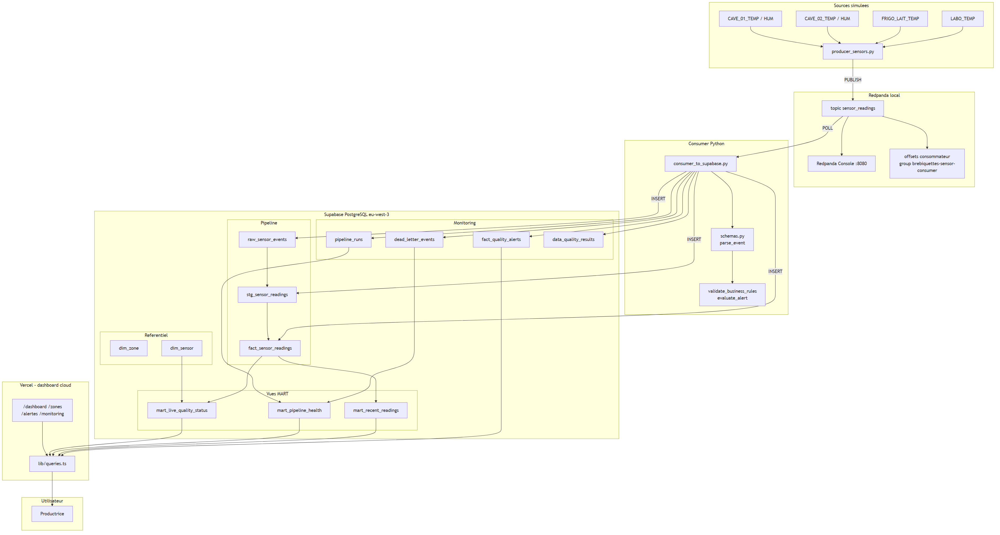

---

## 2. Pipeline temps réel — diagramme de séquence

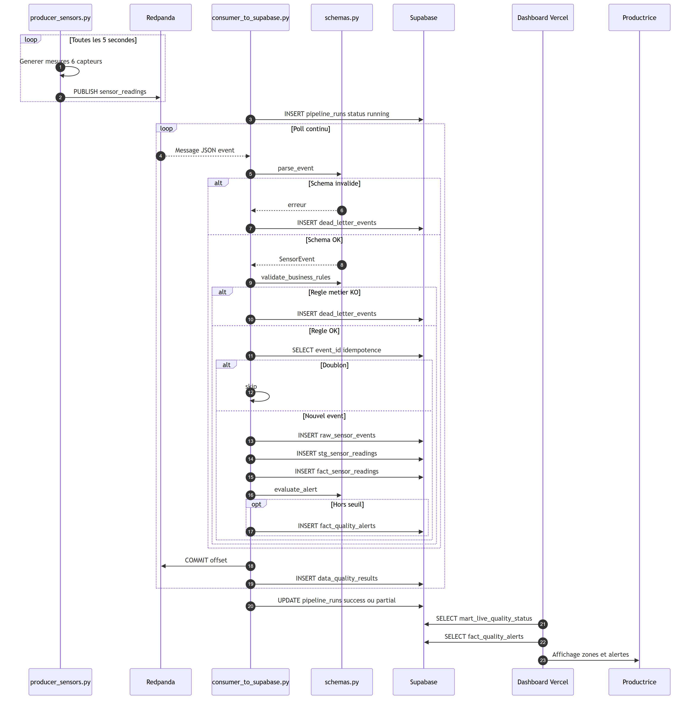

---

## 3. Lineage données — de la source au dashboard

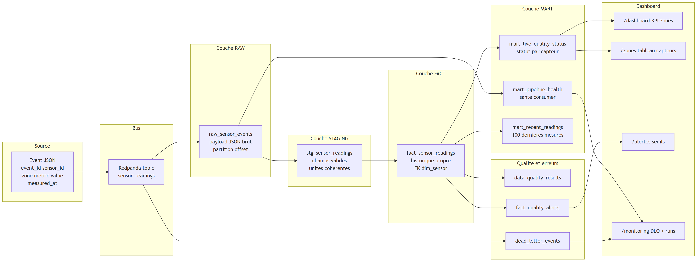

---

## 4. Contrôles qualité — quand et où

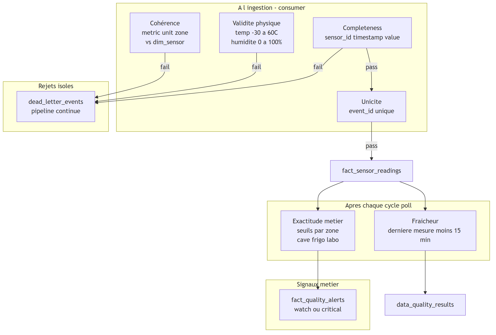

---

## 5. Modèle de données — ER simplifié

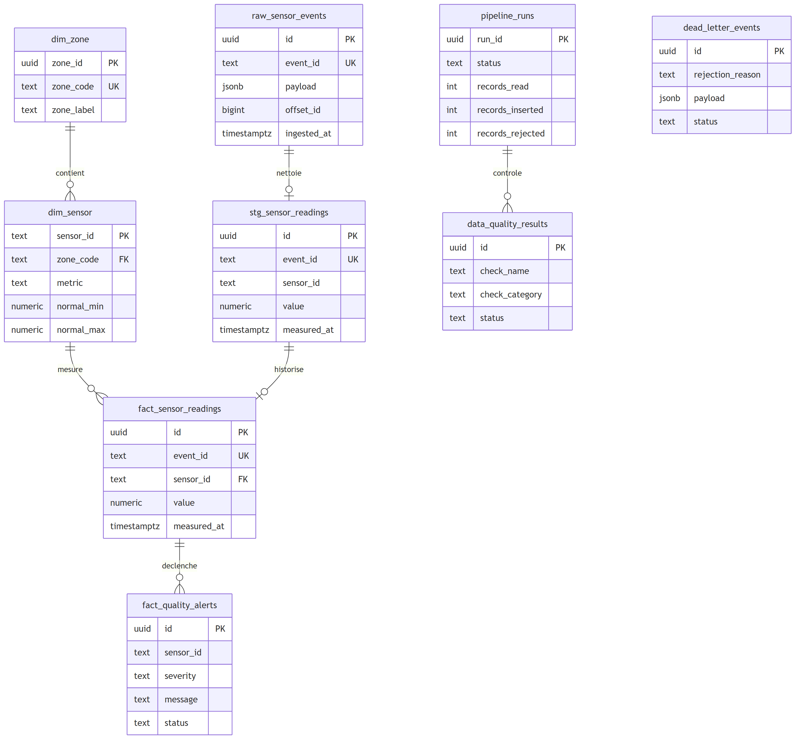

---

## 6. Zones surveillées — vue métier

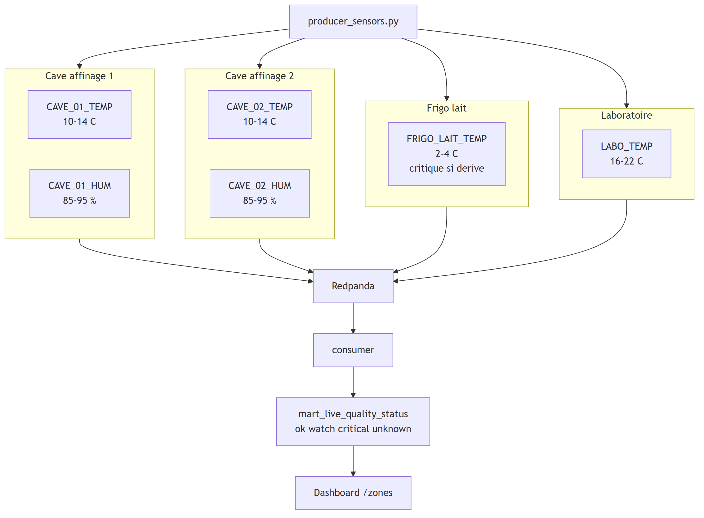

---

## 7. Gestion d'erreurs — scénarios de démo

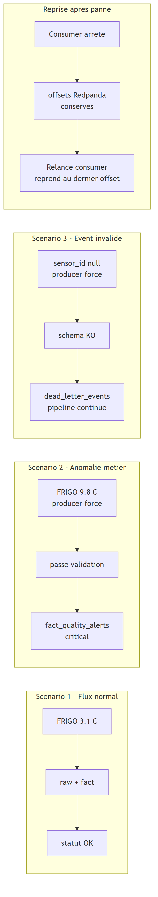

---

## 8. Chaîne CI/CD et déploiement

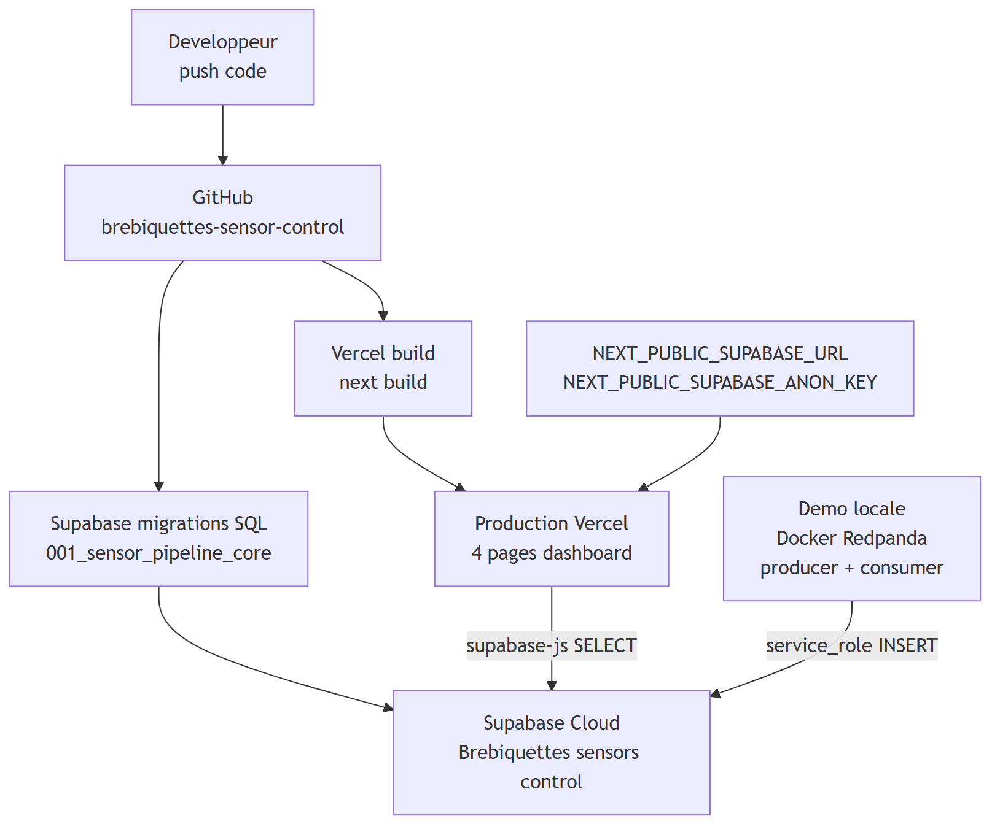

---

## 9. Continuité Bloc 1 → Bloc 2 → Bloc 3

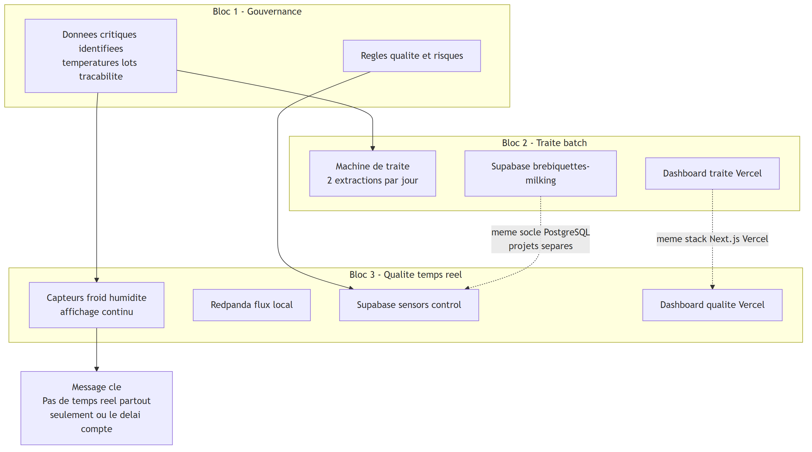

---

## 10. Pourquoi Redpanda et pas batch ? (comparaison Bloc 2)

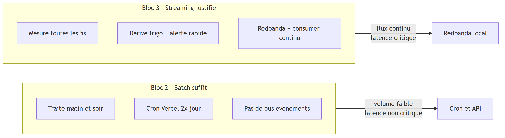

---

## Fichiers code ↔ diagrammes

| Diagramme | Fichiers |
|-----------|----------|
| Producer | `python/producer_sensors.py`, `python/sensors.py` |
| Validation | `python/schemas.py`, `tests/test_*.py` |
| Consumer | `python/consumer_to_supabase.py` |
| Redpanda | `docker-compose.yml` |
| Schéma SQL | `supabase/migrations/001_sensor_pipeline_core.sql` |
| Dashboard | `app/(dashboard)/*`, `lib/queries.ts` |
| Déploiement | GitHub → Vercel (dashboard seul) |
